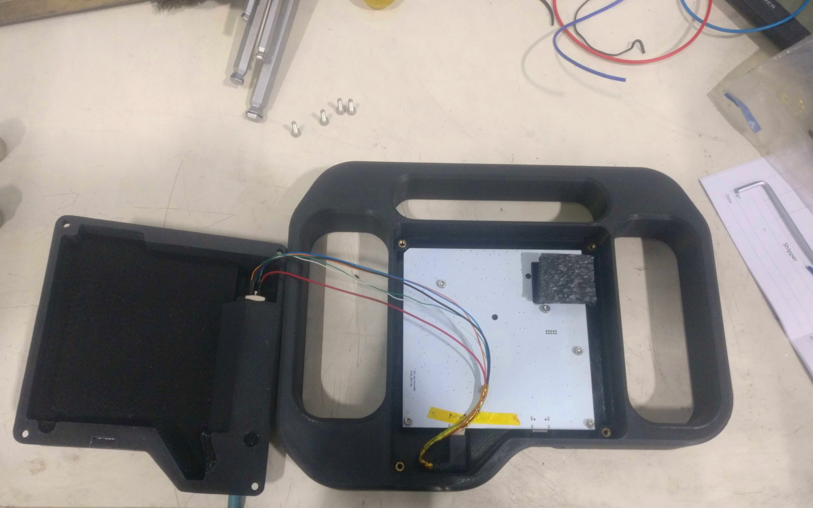

# Jog2k Heavy Industry Case

This is a case for the Jog2k with large, ergonomic grips and provisions for use of a longer cable.

**Warning**: This mod requires soldering custom cables, and possibly modifying SMT components on the Jog2k PCBs. As always, you are responsible for wiring things correctly to avoid possible damage to your hardware!

## Bill of materials

- Jog2k [PCB](https://expatria.myshopify.com/products/jog2k-keypad-pendant-pcba) and [Buttons](https://expatria.myshopify.com/products/flexihal-encoder-breakout-pcba-copy).
- 3D printed [front](./CAD/case_front.stl) and [back](./CAD/case_back.stl) case halves.
- 4x M3 threaded inserts, E.G.: [These ones](https://cnckitchen.store/products/heat-set-insert-m2-x-3-100-pieces) from CNC kitchen.
- 4x M3 socket head cap screws, 10mm long.
- industrial Ethernet cable with at least on M12 end. E.G.: [This one](https://www.digikey.com/short/9mrhdw5j). This is a standard part, also available from many sellers on Amazon or the like.
- M12 bulkhead connector to match your cable. E.G.: [This one](https://www.digikey.ca/short/vz40fct9) or something equivalent.

Note that M12 connectors are available in **A-coded**, **X-coded**, and other variants. Any of them will work if at least **6** pins are available, as long as you purchase a matching cable and bulkhead connector.

## Assembly notes

- Print the enclosure parts and install the threaded inserts.
- Cut an existing right angle USB cable in half, and splice it in between the bulkhead connector, Ethernet cable, and Jog2k interface breakout PCBs. Carefully match each of the following 6 signals at either end of the cable:
  - +5V
  - GND
  - KPSTR (key press trigger)
  - HALT
  - SDA (Data)
  - SCL (clock)
- Consider using some kapton tape to manage the USB wires during final assembly of the case.

**Note**: Depending on the length of cable used, the I2C bus extenders on the Jog2k main and breakout PCBs may need to have their pull-up resistor adjusted. Refer to [this data sheet for the P82B715 bus extender chip](https://www.nxp.com/docs/en/data-sheet/P82B715.pdf).
